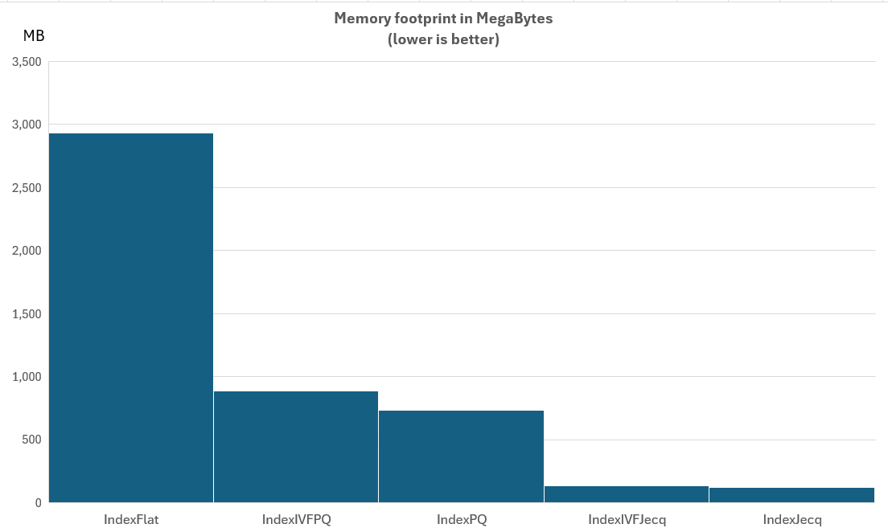

# Jecq KPIs
This document contains the results of running the various scripts contained within the `demos` folder.

## Results

### `demos\demo_parameter_optimize.py`

|   score |   pq_multiplier |   th_high |      th_mid |   search_accuracy |   mem_usage_ratio |   pq_ratio |   itq_ratio |   discarded_ratio |
|--------:|----------------:|----------:|------------:|------------------:|------------------:|-----------:|------------:|------------------:|
| 3.81651 |         625.823 | 0.0079425 | 8.56425e-05 |           0.84636 |          0.158854 |  0.0520833 |    0.854167 |         0.09375   |
| 3.81597 |         624.152 | 0.0079425 | 8.56425e-05 |           0.84632 |          0.158854 |  0.0520833 |    0.854167 |         0.09375   |
| 3.81327 |         593.448 | 0.0079425 | 8.56425e-05 |           0.84612 |          0.158854 |  0.0520833 |    0.854167 |         0.09375   |
| 3.78545 |         624.152 | 0.0079425 | 0.000100292 |           0.83942 |          0.15625  |  0.0520833 |    0.828125 |         0.119792  |
| 3.7466  |         872.321 | 0.0079425 | 8.56425e-05 |           0.84116 |          0.158854 |  0.0520833 |    0.854167 |         0.09375   |

### `demos\demo_search_accuracy_compare.py`

| index        |   search_accuracy |
|:-------------|------------------:|
| IndexFlat    |            1      |
| IndexPQ      |            1      |
| IndexIVFPQ   |            0.997  |
| IndexJecq    |            0.8418 |
| IndexIVFJecq |            0.8239 |

### `demos\demo_resource_compare.py`

| index        |   memory_usage_mb |   train_time_sec |   add_time_sec |   search_time_sec |
|:-------------|------------------:|-----------------:|---------------:|------------------:|
| IndexFlat    |           2929.71 |             0    |           0.91 |              1.62 |
| IndexPQ      |            733.01 |             6.09 |          37.82 |             26.41 |
| IndexIVFPQ   |            887.33 |            22.03 |          65.19 |              6.93 |
| IndexJecq    |            124.14 |            29.3  |          23.36 |             56.37 |
| IndexIVFJecq |            136.44 |            18.19 |          69.32 |              3.56 |



## Methodology

### Dataset

The raw dataset used was:

```
dataset=qiaojin/PubMedQA
name=pqa_artificial
feature_name=long_answer
num_texts=20000
```

This dataset was converted to vector embeddings using
`SentenceTransformer` with:

```
model_name="all-MiniLM-L6-v2"
normalize_embeddings=True
```

### Metrics / Columns
- `pq_ratio` - # of dimensions using PQ compression as a ratio of all dimensions.
- `itq_ratio` - # of dimensions using ITQ compression as a ratio of all dimensions.
- `discarded_ratio` - # of dimensions not used during compression, as a ratio of all dimensions.
- `search_accuracy` - A measure of how good the search results were for an index / parameterization. Note this uses `use_forgiving_metric = True`. Computation methodology: For each query vector, the best 10 matches using `IndexFlat` are used as a reference. If the index produces 5 or more common matches with the reference, its score for that query vector is taken as 1. Otherwise, its score is taken as [# of common matches / 10]. The overall search accuracy is computed as the arithmetic mean of scores for all query vectors used.
- `mem_usage_ratio` - the theoretical memory requirements of a flat Jecq Index as a proportion of the memory requirements of `IndexPQ`. Its value can range between 0 (when `discarded_ratio=1`) and 1 (when `pq_ratio=1`).
- `score` - A measure of how good a parameterization is, balancing compression and accuracy. Computed as

```math
\frac{{search\_accuracy ^ 3}}{{memory\_usage}}
```

### Parameters
Except for `demos\demo_parameter_optimize.py`, the hyper-parameters for `IndexJecq` and `IndexIVFJecq` are taken from the best result of `demos\demo_parameter_optimize.py`above.

Additionally, for `IndexIVFJecq`:

```math
\text{nlist} = \lceil \sqrt{n} \rceil
```

```math
\text{nprobe\_factor} = 0.1
```
